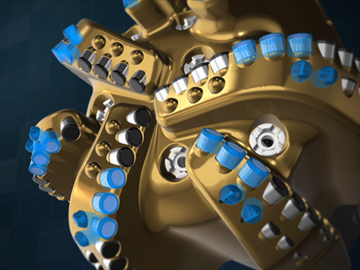
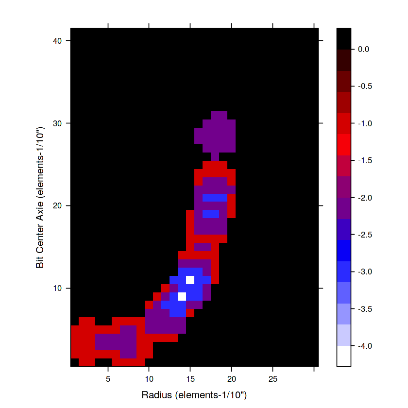
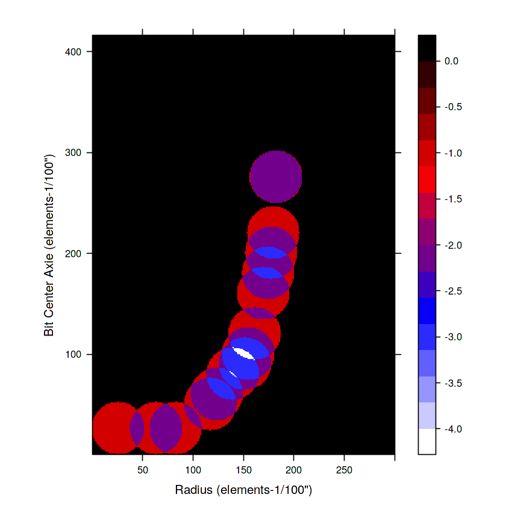

# PDC_Cutter_Interaction_2D
---

  

 A computer model was developed for visualization PDC cutter interaction.
 
Polycrystalline diamond materials, for use in polycrystalline diamond compact (PDC) bits, are one of the most important material advances for oil drilling tools in recent years. Fixed-head bits rotate as one piece and contain no separately moving parts. When fixed-head bits use PDC cutters, they are commonly called PDC bits. Since their first production in 1976, the popularity of bits using PDC cutters has grown steadily, and they are nearly as common as roller-cone bits in many drilling applications.

* In this Kernel a model was developed to simulates the PDC bit cutter interaction.
* The cutter positions including the distance from the bit center and hight are taken into account.
* The PDC cutter interaction model uses matrixes for simulating the position of cutters.
* The matrix is initialized with zero and is updated to new values taking the cutters positions into account.
* The regions with higher cutter interactions are lighter (white) compares to regions with less interactions (black).
* The computer model was developed in R.
* The user can change the simulation resolution. Two visualiztions are presented in this Kernel.

---
### Steps for modeling:
The following Steps are taken for developing a computer model for PDC cutter interaction visualization.

#### Step 1:
Define the size of matrix in accordance with the elements. The matrix is named matrix base MB.

#### Step 2
Define the simulation resolution.

#### Step 3:
Define base matrix.

#### Step 4:
Define the shape function (i.e. circle) and rearrange it base on x.

#### Step 5:
Define the min and max of shape in cartesian coordinate. The circles are on top of x axie and therefore the y min is 0 and the y max is Dc.

#### Step 6:
Turn y_min_cartesian & y_max_cartesian to elements.

* start for y from down (y_min_elements=0).
* turn it to cartesian value; plug it into the circle equation.
* calculate the x in cartesian; turn it back to elements.
* turn both the y and x to Matrix base coordinate and update the Matrix base.
* loop these procedure till get the maximum y element.

---
### Visualization

The first visualization with low resolution and second one with high resolution are seen below.

  
  

Reference: https://petrowiki.org/PDC_drill_bits
Reference PDC bit picture: https://www.bhge.com/upstream/drilling/drill-bits/pdc-drill-bits
